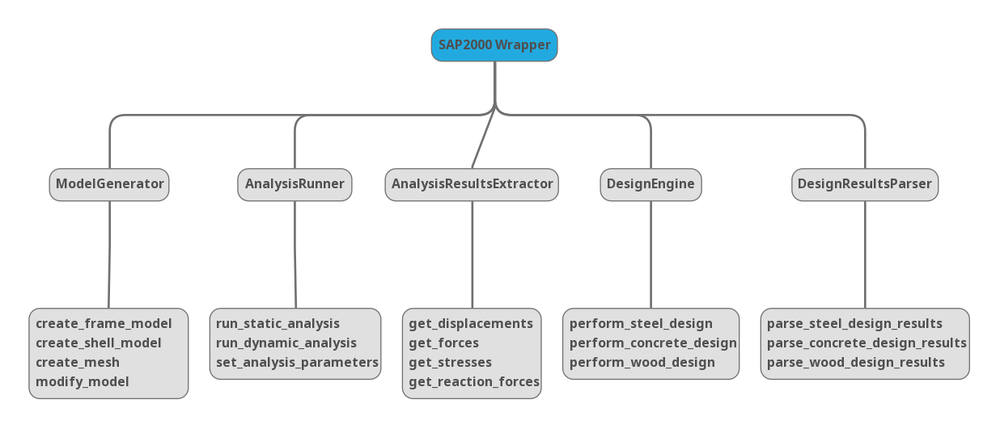

- [1. Layout](#1-layout)
  - [1.1. Roadmap/Checklist](#11-roadmapchecklist)
  - [1.2. Sub-Modules](#12-sub-modules)
    - [1.2.1. Model](#121-model)
      - [1.2.1.1. Usage Examples](#1211-usage-examples)
    - [1.2.2. Element](#122-element)
      - [1.2.2.1. Usage Examples](#1221-usage-examples)
    - [1.2.3. Table](#123-table)
      - [1.2.3.1. Usage Examples](#1231-usage-examples)

# 1. Layout

## 1.1. Roadmap/Checklist



## 1.2. Sub-Modules

### 1.2.1. Model

Collection of methods and attributes that control changes to the model as a whole

#### 1.2.1.1. Usage Examples

```python
#Model
sap.Model.units                             #Returns current model units
sap.Model.units_database                    #Returns Internal Database units
sap.Model.set_units(value='N_m_C')          #Changes the present units of model

sap.Model.merge_tol                         #retrieves the value of the program auto merge tolerance
sap.Model.set_merge_tol(0.05)               #sets the program auto merge tolerance

sap.Model.filepath                          #Returns filepath of current file

sap.Model.is_locked                         #Returns if the model is locked
sap.Model.lock()                            #Locks the model
sap.Model.unlock()                          #Unlocks the model

sap.Model.project_info                      #Returns a dict of Project Info
##Set project info, use `.project_info` to see available keys
sap.Model.set_project_info({'Design Code': 'BCBC 2018'})

sap.Model.logs                              #Retrieve user comments and logs
sap.Model.set_logs('Add this comment')      #Adds user comments/logs
```

### 1.2.2. Element

Collection of methods and attributes that apply changes to elements in the model

#### 1.2.2.1. Usage Examples

```python
##Points
len(sap.Element.Point)                      #list number of points in model
sap.Element.Point.add_by_coord((1,2,3))     #Add point to model
```

### 1.2.3. Table

Control the database values

#### 1.2.3.1. Usage Examples

```python
#Database
sap.Table.list_available()                            #Lists available database tables
sap.Table.list_all()                        #Lists all database tables
```