 <h1> Layout </h1>

- [1. Roadmap/Checklist](#1-roadmapchecklist)
- [2. Sub-Modules](#2-sub-modules)
  - [2.1. Model](#21-model)
  - [2.2. Element](#22-element)
    - [2.2.1. Point](#221-point)
    - [2.2.2. Frames](#222-frames)
  - [2.3. Table](#23-table)
  - [2.4. Loads](#24-loads)
    - [2.4.1. Load Patterns](#241-load-patterns)
    - [2.4.2. Load Cases](#242-load-cases)
    - [2.4.3. Modal](#243-modal)
      - [2.4.3.1. Eigen](#2431-eigen)
      - [2.4.3.2. Ritz](#2432-ritz)
  - [2.5. Results](#25-results)
  - [2.6. Material](#26-material)

# 1. Roadmap/Checklist


# 2. Sub-Modules



## 2.1. Model

Collection of methods and attributes that control changes to the model as a whole

Usage Examples

```python
#Model
sap.Model.units                             #Returns current model units
sap.Model.units_database                    #Returns Internal Database units
sap.Model.set_units(value='N_m_C')          #Changes the present units of model

sap.Model.merge_tol                         #retrieves the value of the program auto merge tolerance
sap.Model.set_merge_tol(0.05)               #sets the program auto merge tolerance

sap.Model.filepath                          #Returns filepath of current file

sap.Model.is_locked                         #Returns if the model is locked
sap.Model.lock()                            #Locks the model
sap.Model.unlock()                          #Unlocks the model

sap.Model.project_info                      #Returns a dict of Project Info
##Set project info, use `.project_info` to see available keys
sap.Model.set_project_info({'Design Code': 'BCBC 2018'})

sap.Model.logs                              #Retrieve user comments and logs
sap.Model.set_logs('Add this comment')      #Adds user comments/logs
```

## 2.2. Element

Collection of methods and attributes that apply changes to elements in the model

### 2.2.1. Point

Manipulate Point Elements

Usage Examples

```python
points = sap.Element.Point
len(points)                                 #list number of points in model
points.add_by_coord((1,2,3))                #Add point to model
points.is_selected(name='1')                #Check if point is selected
points.selected()                           #Yields selected points
points.all()                                #Lists all defined points
points.rename(old_name='1', new_name='1_1') #Rename point
points.check_element_legal(name='1')        #Asserts point's existance
points.delete(name='1')                     #Delete point
```

### 2.2.2. Frames

Manipulate Frame Elements

Usage Examples

```python
frames = sap.Element.Frame
len(frames)                                 #list number of frames in model
frames.is_selected(name='1')                #Check if frame is selected
frames.selected()                           #Yields selected frames
frames.all()                                #Lists all defined frames
frames.rename(old_name='1', new_name='1_1') #Rename frame
frames.check_element_legal(name='1')        #Asserts frame's existance
frames.get_section(frame_name='1')          #Get the assigned Section name
frames.get_points(frame_name='1')           #Get points connected to frame
frames.delete(name='1')                     #Delete frame

frames.Prop.rename(old_name="FSEC1", new_name="MySection")  #Rename frame property
frames.Prop.total()                         #Total # of defined frame properties
```

## 2.3. Table

Control the database values

Usage Examples

```python
#Database
sap.Table.list_available()                            #Lists available database tables
sap.Table.list_all()                        #Lists all database tables
```

## 2.4. Loads

Control the definition and assignments of loads.

### 2.4.1. Load Patterns

Usage Examples

```python
pattern = sap.Load.Pattern
len(pattern)                   # List the number of load patterns defined
pattern.list_all()             #List defined load patterns
pattern.rename('Dead', 'Live') #Rename previously defined pattern
pattern.delete(name='Dead')    #Delete a load pattern

pattern.get_selfwt_multiplier('DEAD')           #Get defined self weight multiplier
pattern.set_selfwt_multiplier('DEAD', 1.15)     #Set self weight multiplier

pattern.get_loadtype('DEAD')                        #Get the defined load type
pattern.set_loadtype('DEAD', pattern_type='LIVE')   #Set the defined load type

#Add a Live load case with name "Custom Live", a 1.15x self weight multiplier and also generate an accompanying load case
pattern.add(name='Custom Live', pattern_type='LIVE', 
            selfwt_multiplier=1.15, add_case=True)
```

### 2.4.2. Load Cases

Usage Examples

```python
cases = sap.Load.Case
len(cases)                      #returns total # of defined cases
cases.total(casetype='MODAL')   #Get # of modal load cases
cases.list_all()                #List all load cases
cases.rename('DEAD','WATER')    #Rename existing load case
cases.case_info(name='DEAD')    #Get the Case type information
cases.set_type(name='DEAD', casetype='LINEAR_STATIC')   #Change the case type of existing load case
```

### 2.4.3. Modal

`sap.Load.Modal`

#### 2.4.3.1. Eigen

Usage Examples

```python
eigen = sap.Load.Modal.Eigen
eigen.set_case(case_name="LCASE1")          #Set a Eigen Modal case

eigen.set_initial_case(case_name='LCASE1', initial_case='DEAD')    #Set initial stiffness case
eigen.get_initial_case(case_name="LCASE1")  #Get the Initial Case

eigen.get_loads(case_name='LCASE1')         #Get the load data

#Set Eigen parameters
eigen.set_parameters(
    case_name='LCASE1',
    EigenShiftFreq=0.05,    #cyc/s
    EigenCutOff=0.0001,     #cyc/s
    EigenTolerance=0.00000001,
    AllowAutoFreqShift=True
)
eigen.get_parameters(case_name='LCASE1')    #Get Parameters

eigen.set_number_modes(case_name='LCASE1', max=10, min=5)   #set number of modes
eigen.get_number_modes(case_name='LCASE1')                  #get number of modes
```

#### 2.4.3.2. Ritz

Usage Examples

```python
ritz = sap.Load.Modal.Ritz
ritz.set_case(case_name="LCASE1")          #Set a Eigen Modal case

ritz.set_initial_case(case_name='LCASE1', initial_case='DEAD')    #Set initial stiffness case
ritz.get_initial_case(case_name="LCASE1")  #Get the Initial Case

ritz.get_loads(case_name='LCASE1')         #Get the load data

ritz.set_number_modes(case_name='LCASE1', max=10, min=5)   #set number of modes
ritz.get_number_modes(case_name='LCASE1')                  #get number of modes
```

## 2.5. Results

Manipulate Results from SAP2000

Usage Examples

```python
results = sap.Results

setup = sap.Results.Setup
setup.clear_casecombo()                     #Deselect all Case&Combo for results
setup.select_case(casename='DEAD')          #sets an load case selected for output flag.
setup.is_selected_case(casename='DEAD')     #checks if an load case is selected for output.
setup.select_combo(comboname='DEAD')        #sets an load combo selected for output flag.
setup.is_selected_combo(comboname='COMB1')  #checks if an load combo is selected for output.
setup.set_rxn_loc_get(x=0.5, y=0.5, z=5)    #sets coordinates of the locn at which the base reactions are reported.               
setup.base_rxn_loc_get()                    #retrieves coordinates of the locn at which the base reactions are reported.

results.joint_reactions(jointname='1')      #Get Joint reactions as dict
```

## 2.6. Material

Usage Examples

```python
material = sap.Material
material.rename(old="4000Psi", new="MatConc")   #Rename existing material
material.total()                                #Total # of defined material properties
material.delete(name='4000Psi')                 #Delete existing material property
material.list_all()                             #List all defined Material Properties
material.get_props(name='4000Psi')              #Returns basic material property data
material.add(name='Steel', material_type='Steel')           #Initialze Material Property
material.set_isotropic(name='Steel', E=29500, poisson=0.25, thermal_coeff=6e-06)    #Set isotropic material properties
material.set_density(name='Steel', mass_per_vol=0.00029)    #set density
```
