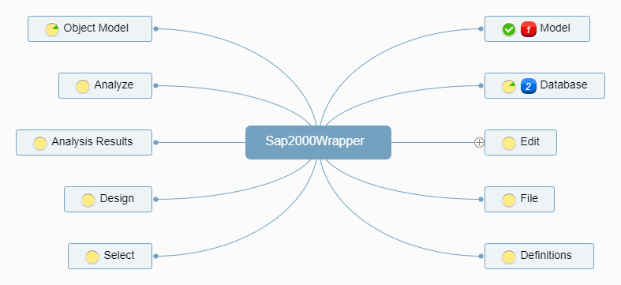

- [1. Layout](#1-layout)
  - [1.1. Roadmap/Checklist](#11-roadmapchecklist)
  - [1.2. Sub-Modules](#12-sub-modules)
    - [1.2.1. Model](#121-model)
    - [1.2.2. Element](#122-element)
    - [1.2.3. Table](#123-table)
    - [1.2.4. Loads](#124-loads)
      - [1.2.4.1. Load Patterns](#1241-load-patterns)
      - [1.2.4.2. Load Cases](#1242-load-cases)
      - [1.2.4.3. Modal](#1243-modal)
        - [1.2.4.3.1. Eigen](#12431-eigen)

# 1. Layout

## 1.1. Roadmap/Checklist



## 1.2. Sub-Modules

### 1.2.1. Model

Collection of methods and attributes that control changes to the model as a whole

Usage Examples

```python
#Model
sap.Model.units                             #Returns current model units
sap.Model.units_database                    #Returns Internal Database units
sap.Model.set_units(value='N_m_C')          #Changes the present units of model

sap.Model.merge_tol                         #retrieves the value of the program auto merge tolerance
sap.Model.set_merge_tol(0.05)               #sets the program auto merge tolerance

sap.Model.filepath                          #Returns filepath of current file

sap.Model.is_locked                         #Returns if the model is locked
sap.Model.lock()                            #Locks the model
sap.Model.unlock()                          #Unlocks the model

sap.Model.project_info                      #Returns a dict of Project Info
##Set project info, use `.project_info` to see available keys
sap.Model.set_project_info({'Design Code': 'BCBC 2018'})

sap.Model.logs                              #Retrieve user comments and logs
sap.Model.set_logs('Add this comment')      #Adds user comments/logs
```

### 1.2.2. Element

Collection of methods and attributes that apply changes to elements in the model

Usage Examples

```python
##Points
len(sap.Element.Point)                      #list number of points in model
sap.Element.Point.add_by_coord((1,2,3))     #Add point to model
```

### 1.2.3. Table

Control the database values

Usage Examples

```python
#Database
sap.Table.list_available()                            #Lists available database tables
sap.Table.list_all()                        #Lists all database tables
```

### 1.2.4. Loads

Control the definition and assignments of loads.

#### 1.2.4.1. Load Patterns

Usage Examples

```python
pattern = sap.Load.Pattern
len(pattern)                   # List the number of load patterns defined
pattern.list_all()             #List defined load patterns
pattern.rename('Dead', 'Live') #Rename previously defined pattern
pattern.delete(name='Dead')    #Delete a load pattern

pattern.get_selfwt_multiplier('DEAD')           #Get defined self weight multiplier
pattern.set_selfwt_multiplier('DEAD', 1.15)     #Set self weight multiplier

pattern.get_loadtype('DEAD')                        #Get the defined load type
pattern.set_loadtype('DEAD', pattern_type='LIVE')   #Set the defined load type

#Add a Live load case with name "Custom Live", a 1.15x self weight multiplier and also generate an accompanying load case
pattern.add(name='Custom Live', pattern_type='LIVE', 
            selfwt_multiplier=1.15, add_case=True)
```

#### 1.2.4.2. Load Cases

Usage Examples

```python
cases = sap.Load.Case
len(cases)                      #returns total # of defined cases
cases.total(casetype='MODAL')   #Get # of modal load cases
cases.list_all()                #List all load cases
cases.rename('DEAD','WATER')    #Rename existing load case
cases.case_info(name='DEAD')    #Get the Case type information
cases.set_type(name='DEAD', casetype='LINEAR_STATIC')   #Change the case type of existing load case
```

#### 1.2.4.3. Modal

`sap.Load.Modal`

##### 1.2.4.3.1. Eigen

Usage Examples

```python
eigen = sap.Load.Modal.Eigen
eigen.set_case(case_name="LCASE1")          #Set a Eigen Modal case

eigen.set_initial_case(case_name='LCASE1', initial_case='DEAD')    #Set initial stiffness case
eigen.get_initial_case(case_name="LCASE1")  #Get the Initial Case

eigen.get_loads(case_name='LCASE1')         #Get the load data

#Set Eigen parameters
eigen.set_parameters(
    case_name='LCASE1',
    EigenShiftFreq=0.05,    #cyc/s
    EigenCutOff=0.0001,     #cyc/s
    EigenTolerance=0.00000001,
    AllowAutoFreqShift=True
)
eigen.get_parameters(case_name='LCASE1')    #Get Parameters

eigen.set_number_modes(case_name='LCASE1', max=10, min=5)   #set number of modes
eigen.get_number_modes(case_name='LCASE1')                  #get number of modes
```
