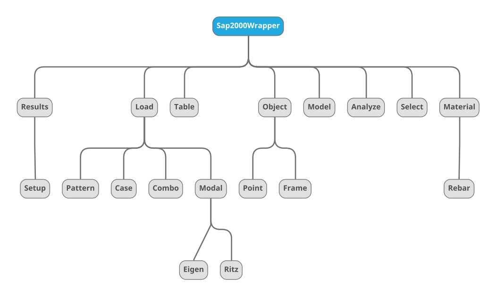

 <h1> Layout </h1>

- [Layout Map](#layout-map)
- [Initialize](#initialize)
- [Parent Level](#parent-level)
- [Sub-Modules](#sub-modules)
  - [Model](#model)
  - [Element](#element)
    - [Point](#point)
    - [Frame](#frame)
  - [Database](#database)
  - [Select](#select)
  - [Loads](#loads)
    - [Load Patterns](#load-patterns)
    - [Load Cases](#load-cases)
    - [Modal](#modal)
      - [Eigen](#eigen)
      - [Ritz](#ritz)
  - [Analyze](#analyze)
  - [Results](#results)
  - [Material](#material)
    - [Rebar](#rebar)

# Layout Map



# Initialize

Usage Examples:

```python
from ak_sap import debug, Sap2000Wrapper
debug(status=False)

#Initialize
sap = Sap2000Wrapper(attach_to_exist=True)      #Attach to existing opened model
sap = Sap2000Wrapper(attach_to_exist=False)     #Create new blank model from latest SAP2000
## Create blank model from a custom version of SAP2000
sap = Sap2000Wrapper(attach_to_exist=False, program_path=r'Path\to\SAP2000.exe')
```

# Parent Level

Usage Examples:

```python
sap.hide()                                  #Hide the SAP2000 window
sap.unhide()                                #Unhides SAP2000 window
sap.ishidden                                #Check if window is hidden
sap.version                                 #Returns SAP2000 version number
sap.api_version                             #Returns Sap0API version number
sap.exit(save=False)                        #Exit the application

sap.save(r'\Path\to\save\file.sdb')
```

# Sub-Modules
## Model

Collection of methods and attributes that control changes to the model as a whole

Usage Examples:

```python
sap.Model.units                             #Returns current model units
sap.Model.units_database                    #Returns Internal Database units
sap.Model.set_units(value='N_m_C')          #Changes the present units of model

sap.Model.merge_tol                         #retrieves the value of the program auto merge tolerance
sap.Model.set_merge_tol(0.05)               #sets the program auto merge tolerance

sap.Model.filepath                          #Returns filepath of current file

sap.Model.is_locked                         #Returns if the model is locked
sap.Model.lock()                            #Locks the model
sap.Model.unlock()                          #Unlocks the model

sap.Model.project_info                      #Returns a dict of Project Info
##Set project info, use `.project_info` to see available keys
sap.Model.set_project_info({'Design Code': 'BCBC 2018'})

sap.Model.logs                              #Retrieve user comments and logs
sap.Model.set_logs('Add this comment')      #Adds user comments/logs
```

## Element

Collection of methods and attributes that apply changes to elements in the model

Usage Examples:

```python
object = sap.Object
object.move_selected(dx=0.5, dy=0, dz=1.0)  #Move selected object
object.copy(dx=0.5, dy=0, dz=0, num=10)#copy selected object

#Mirror and create object
from ak_sap import Coord
pt1 = Coord(x=10, y=20, z=0)
p2 = Coord(x=10, y=30, z=0)
object.mirror(plane='Z', coord1=pt1, coord2=pt2)    #Mirror replicate selected obj.
```

### Point

Manipulate Point Elements

Usage Examples:

```python
points = sap.Object.Point
len(points)                                 #list number of points in model
points.add_by_coord((1,2,3))                #Add point to model
points.is_selected(name='1')                #Check if point is selected
points.selected()                           #Yields selected points
points.all()                                #Lists all defined points
points.rename(old_name='1', new_name='1_1') #Rename point
points.check_obj_legal(name='1')            #Asserts point's existance
points.delete(name='1')                     #Delete point

#Manipilate
points.deselect_all()                       #Deselect all points
points.select(name='1')                     #Select a single point
points.align(axis='Z', ordinate = 100)      #Align selected points
points.deselect(name='1')                   #Deselect a single point

points.merge(tolerance=2)                   #Merge points that are within tol
points.change_coord(name='1', x=0, y=0, z=0)#Change point coordinate
```

### Frame

Manipulate Frame Elements

Usage Examples:

```python
frames = sap.Object.Frame
len(frames)                                 #list number of frames in model
frames.is_selected(name='1')                #Check if frame is selected
frames.selected()                           #Yields selected frames
frames.all()                                #Lists all defined frames
frames.rename(old_name='1', new_name='1_1') #Rename frame
frames.check_obj_legal(name='1')            #Asserts frame's existance
frames.get_section(name='1')          #Get the assigned Section name
frames.get_points(name='1')           #Get points connected to frame

#Manipulation
frames.delete(name='1')                     #Delete frame
frames.divide_by_distance(name='1',
    dist=0.5,Iend=True)                     #Divide frame by distance
frames.divide_by_intersection(name='2')   #Divide at selected intersections
frames.divide_by_ratio(name='3',ratio=0.3)#Divide at selected ratio
frames.join('2','3')                  #Join Colinear frames
frames.change_points(name='1', point1='1', point2='3')  #Change connected points of frame

# Get frame properties
frames.Prop.rename(old_name="FSEC1", new_name="MySection")  #Rename frame property
frames.Prop.total()                         #Total # of defined frame properties
```

## Database

Control the database values

Usage Examples:

```python
tables = sap.Table
tables.list_available()                              #Lists available database tables
tables.list_all()                                    #Lists all database tables
tables.get_table_fields('Analysis Options')          #Get table Field Info
tables.get(TableKey='Load Case Definitions', dataframe=False)     #Get Table data in `list[dict]` format
df = tables.get('Material Properties 01 - General')                 #Get Table data in pandas dataframe

# Update Table
df.iloc[0,0] = 'New Value'
tables.update(TableKey='Material Properties 01 - General', data=df, apply=True)
```

## Select

Usage Examples:

```python
select = sap.Select

select.all()                                    #Select all objects
select.clear()                                  #Deselect all objects

select.constraint(name='Diaph1')                #Select points in constraint
select.constraint(name='Diaph1', reverse=True)  #Deselect points in constraint

select.invert()                 #Invert selections
select.selected                 #Returns list of selected objects
select.previous()               #restores the previous selection

#Selection based on plane
select.in_plane(pointname='1', plane='XY')                  #Select in XY plane
select.in_plane(pointname='2', plane='YZ', reverse=False)   #Deselect

#Select by property
select.property(type='Area', name='ASEC1')
select.property(type='Cable', name='CAB1', reverse=True)
select.property(type='Frame', name='FSEC1')
select.property(type='Link', name='GAP1', reverse=True)
select.property(type='Material', name='A992Fy50')
select.property(type='Solid', name='SOLID1', reverse=True)
select.property(type='Tendon', name='TEN1')
```

## Loads

Control the definition and assignments of loads.
### Load Patterns

Usage Examples:

```python
pattern = sap.Load.Pattern
len(pattern)                   # List the number of load patterns defined
pattern.list_all()             #List defined load patterns
pattern.rename('Dead', 'Live') #Rename previously defined pattern
pattern.delete(name='Dead')    #Delete a load pattern

pattern.get_selfwt_multiplier('DEAD')           #Get defined self weight multiplier
pattern.set_selfwt_multiplier('DEAD', 1.15)     #Set self weight multiplier

pattern.get_loadtype('DEAD')                        #Get the defined load type
pattern.set_loadtype('DEAD', pattern_type='LIVE')   #Set the defined load type

#Add a Live load case with name "Custom Live", a 1.15x self weight multiplier and also generate an accompanying load case
pattern.add(name='Custom Live', pattern_type='LIVE', 
            selfwt_multiplier=1.15, add_case=True)
```

### Load Cases

Usage Examples:

```python
cases = sap.Load.Case
len(cases)                      #returns total # of defined cases
cases.total(casetype='MODAL')   #Get # of modal load cases
cases.list_all()                #List all load cases
cases.rename('DEAD','WATER')    #Rename existing load case
cases.case_info(name='DEAD')    #Get the Case type information
cases.set_type(name='DEAD', casetype='LINEAR_STATIC')   #Change the case type of existing load case
```

### Modal

`sap.Load.Modal`
#### Eigen

Usage Examples:

```python
eigen = sap.Load.Modal.Eigen
eigen.set_case(case_name="LCASE1")          #Set a Eigen Modal case

eigen.set_initial_case(case_name='LCASE1', initial_case='DEAD')    #Set initial stiffness case
eigen.get_initial_case(case_name="LCASE1")  #Get the Initial Case

eigen.get_loads(case_name='LCASE1')         #Get the load data

#Set Eigen parameters
eigen.set_parameters(
    case_name='LCASE1',
    EigenShiftFreq=0.05,    #cyc/s
    EigenCutOff=0.0001,     #cyc/s
    EigenTolerance=0.00000001,
    AllowAutoFreqShift=True
)
eigen.get_parameters(case_name='LCASE1')    #Get Parameters

eigen.set_number_modes(case_name='LCASE1', max=10, min=5)   #set number of modes
eigen.get_number_modes(case_name='LCASE1')                  #get number of modes
```

#### Ritz

Usage Examples:

```python
ritz = sap.Load.Modal.Ritz
ritz.set_case(case_name="LCASE1")          #Set a Eigen Modal case

ritz.set_initial_case(case_name='LCASE1', initial_case='DEAD')    #Set initial stiffness case
ritz.get_initial_case(case_name="LCASE1")  #Get the Initial Case

ritz.get_loads(case_name='LCASE1')         #Get the load data

ritz.set_number_modes(case_name='LCASE1', max=10, min=5)   #set number of modes
ritz.get_number_modes(case_name='LCASE1')                  #get number of modes
```

## Analyze

Usage Examples:

```python
analyze = sap.Analyze
analyze.create_model()                      #Create analysis model
analyze.run()                               #Runs the analysis
analyze.case_status()                       #retrieves the status for all load cases.
analyze.get_run_status()                    #retrieves the run flags for all cases
analyze.set_run_flag(case='MODAL', status=True) # Set case to run
analyze.get_solver()                        #Get solver info

#Set solver options
analyze.set_solver(
    SolverType='Standard',
    SolverProcessType='Auto',
    NumberParallelRuns=0,
    StiffCase=''
)                    
```

## Results

Manipulate Results from SAP2000

Usage Examples:

```python
results = sap.Results

setup = sap.Results.Setup
setup.clear_casecombo()                     #Deselect all Case&Combo for results
setup.select_case(casename='DEAD')          #sets an load case selected for output flag.
setup.is_selected_case(casename='DEAD')     #checks if an load case is selected for output.
setup.select_combo(comboname='DEAD')        #sets an load combo selected for output flag.
setup.is_selected_combo(comboname='COMB1')  #checks if an load combo is selected for output.
setup.set_rxn_loc_get(x=0.5, y=0.5, z=5)    #sets coordinates of the locn at which the base reactions are reported.               
setup.base_rxn_loc_get()                    #retrieves coordinates of the locn at which the base reactions are reported.

results.joint_reactions(jointname='1')      #Get Joint reactions as list of dict
results.joint_displacements(jointname='1')      #Get Joint displacements as list of dict
results.joint_accelerations(jointname='1')  #Get joint accelerations
results.joint_velocities(jointname='1')     #Get joint velocities

results.delete('MODAL')                     #Delete results of `MODAL` case
results.delete('All')                       #Delete results of all cases
```

## Material

Usage Examples:

```python
material = sap.Material
material.rename(old="4000Psi", new="MatConc")   #Rename existing material
material.total()                                #Total # of defined material properties
material.delete(name='4000Psi')                 #Delete existing material property
material.list_all()                             #List all defined Material Properties
material.get_props(name='4000Psi')              #Returns basic material property data
material.add(name='Steel', material_type='Steel')           #Initialze Material Property
material.set_isotropic(name='Steel', E=29500, poisson=0.25, thermal_coeff=6e-06)    #Set isotropic material properties
material.set_density(name='Steel', mass_per_vol=0.00029)    #set density
```

### Rebar

Usage Examples:

```python
rebar = sap.Material.Rebar
rebar.rename(old='R1', new='MyRebar')           #Rename rebar
rebar.total()                                   #Total # of defined rebar properties
rebar.delete(name='R1')                         #Delete existing rebar property
rebar.list_all()                                #List all defined rebar Properties
rebar.set_prop(name='MyRebar2', area=1.05, dia=1.0) #Define a rebar property
rebar.get_prop(name='MyRebar2')                 #Get rebar property
```
