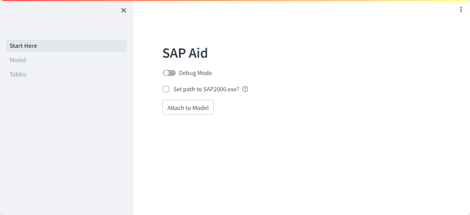
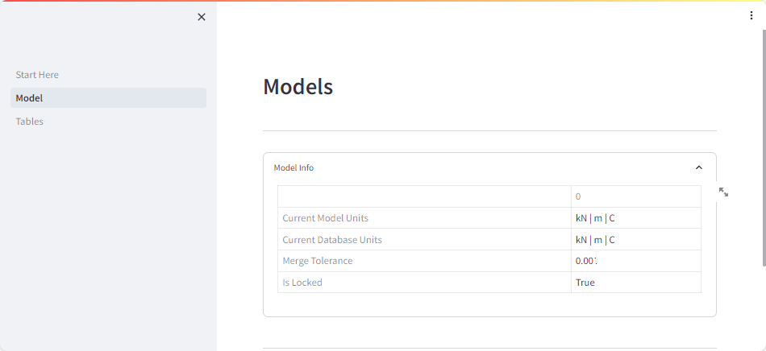
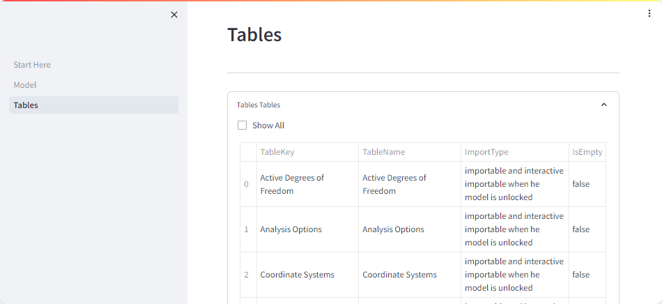
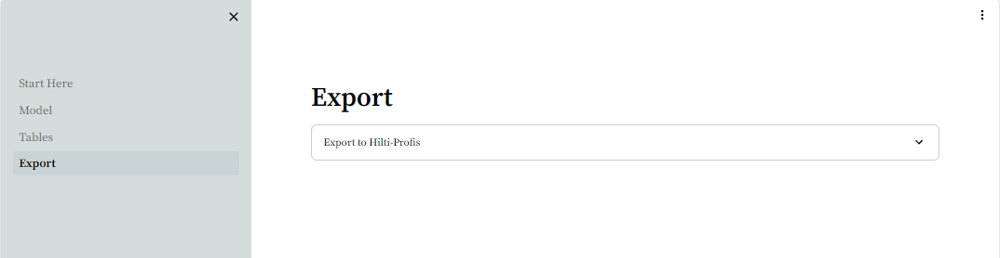
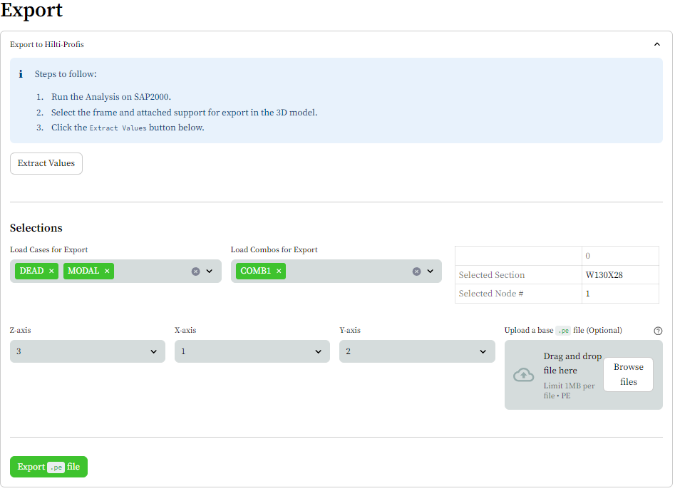

- [1. Usage](#1-usage)
  - [1.1. Attach an Instance](#11-attach-an-instance)
  - [1.2. Models](#12-models)
  - [1.3. Tables](#13-tables)
  - [1.4. Export](#14-export)
    - [1.4.1. Hilti-Profis](#141-hilti-profis)

<h1> Steamlit </h1>

The package not comes pre-compiled with the streamlit package.

# 1. Usage

- Download the Github Repo and `cd` inside
    ```bash
    git clone https://github.com/rpakishore/ak_sap.git
    cd ak_sap
    ```

- Launch the app run

    ```bash
    python -m streamlit run Start_Here.py
    ```

  - Alternatively, In windows launch by executing the script

    ```cmd
    cd scripts
    run.bat
    ```

- Open up the SAP2000 model of your choice and click `Attach to Model`

## 1.1. Attach an Instance



## 1.2. Models



## 1.3. Tables



## 1.4. Export



### 1.4.1. Hilti-Profis



Steps:

1. Run the Analysis on SAP2000
2. Select the frame and attached support point for export from the 3D model.
3. Click the `Extract Values` button in browser.
4. Select the interested load combinations and cases for export.
5. Orient the Axis, by assigning `X`, `Y`, `Z` axis of Hilti to axis `1`(Red), `2` (Green) and `3`(Blue) of SAP.
6. Optionally, upload an exisitng `.pe` file to import default values.
7. Click the `Export .pe file` button.
8. The exported file will be of format "`SAP filename`-`Selected Node #`-`Selected Section Shape`-`MMDD`_`HHMM`.pe"

To Implement:
- [ ] Incorporate the section profile into the `.pe` file.
- [ ] Replace the manual deletion of existing loadcase with inbuilt `delete_existing` method of Hilti-Profis Class in version `0.0.4`.
- [ ] Defer data generation until the click of download button (Part of Streamlit roadmap for May-July 2024).